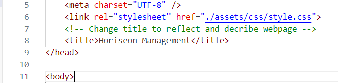
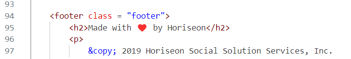
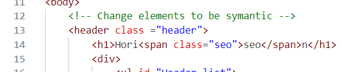
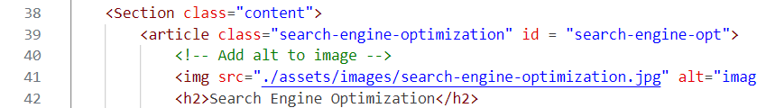
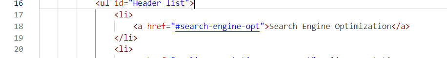

# You Never Forget Your First Assignment 
  by Bradley Moleterno    
## Description
This was our first Boot Camp assignment. Basically, it was an exercise to use semantic elements.  Once the elements were renamed to be more semantic, CSS styling was used to correct any issues that emerged.  It's interesting to see how much trouble I had finishing this exercise without the proper knowledge. It made it much more difficult. There are certain things I corrected which I neglected from my last visit. I changed the title to Horiseon-Management on line 8.

.  

I added a class of footer to line 94 which cleared up the styling of the footer.

 

Likewise, I added a class of heading at line 13, which cleared up the styling of the header. 

.  

I put all the asset files back in the asset directory because six months ago, I didn't know how to do that. And I made an id value of “search-engine-opt” on line 39. 

.  

I updated the link on line 18 to point to the new id.  

.   

That corrected the problem with the link and it now functions as it should.  
## Deployed Application URL
https://boilermaker74.github.io/
## Table of Contents
* [Installation](#installation)
* [How to Use This Application](#how-to-use-this-application)
* [Licenses](#Licenses)
* [Contributors](#contributors)
* [Testing](#testing)
* [Features](#features)
* [Languages and Technologies Used](#languages-and-technologies-used)
* [Dependencies](#dependencies)
* [Questions](#questions)

## Installation
There is no installation, it is simply displayed when a user clicks on the URL.
## How to Use This Application:
It is a simple exercise to use semantic elements and styling. There are links which can be pressed to move about the page.
## Licenses

## Contributors
N/A
## Testing
N/A
## Features
It's nostalgic because I had never coded before.
## Languages and Technologies Used

## Dependencies
NONE
## Questions
Please send your questions by email:  Bradm1492@gmail.com or visit [github/Boilermaker74](https://github.com/Boilermaker74).
